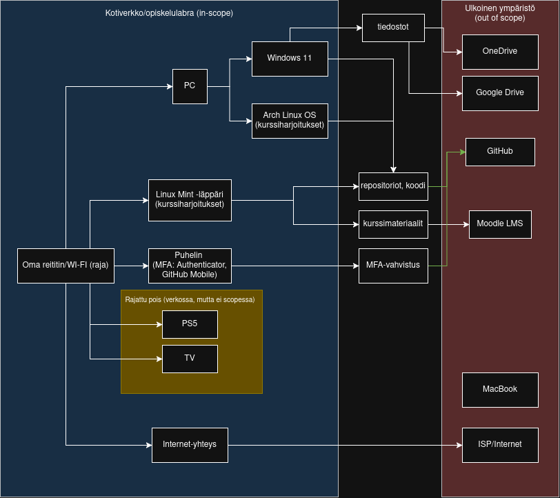

# ISMS-rajauksen määrittely - kotiverkko ja opiskelulaboratorio

## a) ISMS-rajauksen (scope) määrittely

### a1) Mitä sisältyy rajaukseen

Tämän ISMS-rajauksen (Information Security Management System) piiriin kuuluu oma kotitalouteni ja sen IT-ympäristö, jota käytän kurssin harjoitusten suorittamiseen.

**Verkkoinfrastruktuuri**
- Oma reititin/Wi-Fi-tukiasema, joka toimii kotiverkon ja internetin välisenä rajapintana.

**Kurssiharjoituksiin käytettävät laitteet**
- Läppäri, jossa on Linux Mint -käyttöjärjestelmä ja jota käytän nimenomaan kurssin harjoituksiin.
- Pöytäkone, jossa minulla on ladattuna Arch Linux ja Windows käyttöjärjestelmät erillisillä kovalevyillä, teen tällä koneella tämän tehtävän ja muita kurssin kotitehtäviä.
- Puhelin, siltä osin kuin sitä käytetään monivaiheiseen tunnistautumiseen (MFA) Authenticator-sovelluksella sekä palvelukohtaisilla sovelluksilla (esim. GitHub Mobile).

**Tiedot ja data**
- Kurssimateriaalit, omat muistiinpanot, repositoriot ja harjoitusmateriaalit.
- Kirjautumistiedot ja kryptografiset avaimet (MFA-tunnisteet), joita käytetään yllä mainittujen laitteiden ja palveluiden kanssa.

### a2) Mitä rajataan pois ja miksi
- **PS5 ja TV** - viihde-elektroniikkaa, joilla ei ole roolia kurssin harjoituksissa eikä niitä hallinnoida tietoturvamielessä samalla tavalla kuin kurssilaitteita. Riski hyväksytään, koska laitteet eivät käsittele kurssiin liittyvää dataa.
- **MacBook** - käytössä koulussa muilla kursseilla, ei tämän kurssin harjoituksiin.
- **Internet-palveluntarjoajan (ISP) verkko reitittimen ulkopuolella** - en hallinnoi tai voi vaikuttaa ISP:n omaan infrastruktuuriin, joten se jää rajauksen ulkopuolelle omana, erillisenä osapuolenaan.
- **Muut mahdolliset kotiverkon laitteet tulevaisuudessa** - koska asun yksin, muiden asukkaiden laitteita ei ole, jos verkkoon lisätään myöhemmin laitteita, ne arvioidaan tapauskohtaisesti.

### a3) Keskeiset rajapinnat ja rajat
- **Pilvipalvelut:** GitHub (koodi ja repositoriot), Google Drive ja OneDrive (tiedostojen tallennus/jako), Moodle-oppimisympäristö (kurssimateriaalit ja palautukset).
- **Etäyhteydet:** VPN:ää ja RDP:tä ei käytetä. SSH-palveluita ei ole ainakaan tällä hetkellä myöskään käytössä.
- **Kotiverkon ja internetin raja**: oma reititin/palomuuri, joka erottaa kotiverkon (in scope) ulkoisesta ympäristöstä (out of scope).
- **Toimittajat ja palveluntarjoajat**: internet-palveluntarjoaja (yhteys), laitevalmistajat (reititin, läppäri, pöytäkone, puhelin) sekä pilvipalveluntarjoajat GitHub, Google ja Microsoft.

---

## Verkko- ja rajapintakaavio

---

## Evidence Addendum - "What evidence could I present?"

- **Reititin**: Kuvakaappaus reitittimen hallintapaneelista (laiteohjelmiston versio, Wi-Fi-salausasetukset, kytketyt laitteet -lista).

- **Laitteisto (Arch Linux -pöytäkone, Linux Mint -läppäri)**: Laiteluettelo käyttöjärjestelmineen ja versioineen (uname -a, lsb_release -a), sekä lista asennetuista päivityksistä/paketeista.

- **MFA (puhelin)**: Kuvakaappaus Authenticator-sovelluksen aktiivisista tileistä (tunnisteet peitettynä) ja GitHubin tilin turvallisuusasetuksista, joista näkyy MFA käytössä.

- **Pilvipalvelut**: Linkki GitHub-repositorioon, kuvakaappaus Google Driven ja OneDriven jaettujen kansioiden asetuksista, sekä Moodle-tilin kirjautumisloki.

- **Rajatut laitteet (PS5, TV)**: Lista reitittimen kytkettyjen laitteiden näkymästä, josta käy ilmi että laitteet on tunnistettu mutta rajattu ulkopuolelle.

- **Varmuuskopiointi**: Todetaan, ettei varmuuskopiointia ole tällä hetkellä käytössä -tämä kirjataan tunnistetuksi puutteksi/riskiksi dokumentaatioon.

---

## b) Tehtävän liittäminen standardiin

| Sidosryhmä | Tarve tai vaatimus | ISO 27001 -viittaus (vaatimusalue) | Miten vaatimustenmukaisuus osoitetaan (näyttö) |
|---|---|---|---|
| Minä itse | Kurssiharjoitusten jatkuvuus, oman datan (koodi, muistiinpanot, tunnistetiedot) säilyminen ja saatavuus | Operatiivinen toiminta (Operation) | Repositorioiden versiohistoria GitHubissa, MFA käytössä keskeisissä tileissä, tiedostot tallennettuna pilvipalveluihin |
| Internet-palveluntarjoaja | Palvelusopimuksen ja laitteiden käyttöehtojen noudattaminen (esim. reitittimen asianmukainen käyttö, ei väärinkäyttöä) | Konteksti (Context) | Voimassa oleva sopimus ja reitittimen laiteohjelmiston pysyminen ajan tasalla käyttöehtojen mukaisesti |
| Pilvipalveluntarjoajat (GitHub, Google, Microsoft) | Tilien turvallisuus (MFA käytössä), palveluehtojen noudattaminen | Tuki (Support) | Kuvakaappaus MFA-asetuksista, käyttöoikeuksien ja jaettujen kansioiden tarkistus |
| Oppilaitos / kurssin järjestäjä | Akateeminen rehellisyys, varmuus ettei verkosta tehdä haitallista toimintaa | Suorituskyvyn arviointi (Performance Evaluation) | Palautetut tehtävät ja repositoriot ovat jäljitettävissä omaan tiliin, ei epäilyttävää verkkoliikennettä laitteista |

---

### Lähteet

- https://terokarvinen.com/application-hacking/#laksyt (tehtavänanto)
