# h2 Break & Unbreak (Tero)

## x) Read/watch/listen and summarize

### OWASP Top 10:

- OWASP Top 10 on dokumentti, jossa tuodaan esille laaja yhteenveto kaikista kriittisimmistä turvallisuusriskeistä web sovelluksille.
- Top 1 turvallisuusriski on "Broken Access Control", joka löytyi jossain muodossa kaikista testatuista sovelluksista.
- BAC on turvallisuusriski, jossa systeemi epäonnistuu kunnollisesti rajaamaan, mitä autentikoitu käyttäjä saa tehdä tai nähdä sovelluksessa.

### Karvinen 2023:

- Fuff on web "fuzzaaja", jonka on tehnyt Joona "joohoi" Hoikkala. Käytännössä se automatisoi HTTP pyyntöjen lähettämisprosessin, ettei hakkerin tarvitse manuaalisesti lähettää eri pyyntöjä toistensa jälkeen.
- Teron artikkeli sisältää ohjeita miten ffuf-työkalua voi hyödyntää lokaalisti löytääkseen haavoittuvuuksia web sovelluksesta. Se sisältää myös lukijan suoritettavan haasteen.

### PortSwigger:

- PortSwiggerin artikkelissa selitetään esimerkeillä ja teorialla mitä access control tarkoittaa, ja minkälaisia haavoittuvuuksia siitä voi syntyä.
- Artikkelissa myös selitetään miten access control haavoittuvuuksia voidaan estää.

### Karvinen 2006

- Tässä Teron artikkelissa Tero selittää minkälainen raportin kuuluu olla, kun jotain testataan tietokoneella, kuten tämän kurssin harjoitustehtävien raportit.
- Raportin tulee olla toistettava, lukijan täytyy pystyä toistamaan testit samoilla lopputuloksilla, kuin raportin tekijällä
- Täsmällinen, pitää olla selkeää mitä työkaluja on käytetty, missä järjestyksessä ja onko testeissä tai työkaluissa ollut ongelmia
- Helppolukuinen, käytä väliotsikoita, kirjoita selkeää ja huolellista kieltä. 
- Raportissa täytyy viitata lähteisiin, koska hyvä tapa ja akateeminen käytäntö vaatii viittauksia.
- Artikkelissa on myös paljon esimerkkejä raporteista ja yleisiä mokia raportin kirjoittamisessa.

---

## a) Break into 010-staff-only

Aloitin tehtävän lataamalla zip tiedoston, jossa on haasteet `wget` komennolla.

Purin myös zip tiedostosta haasteet `unzip` komennolla.

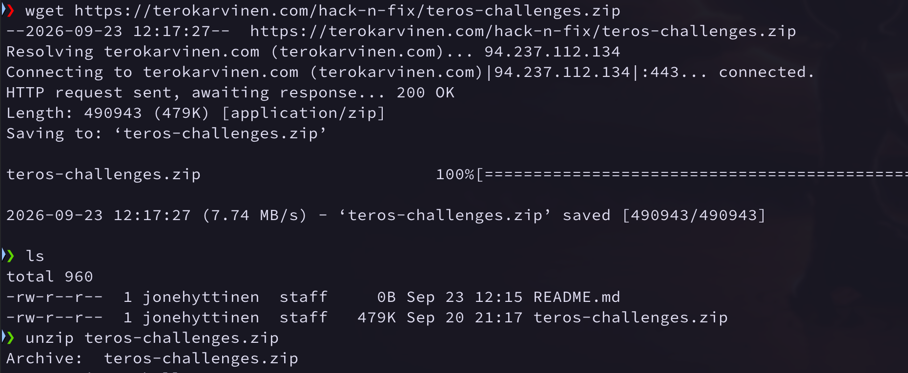
(Latasin tiedostot Macilla, sen takia UI näyttää erilaiselta.)

---

Zip-tiedosto sisälsi challenges tiedoston, jonka sisällä on seuraavat kaksi haastetta:

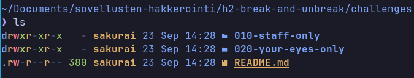


Ensimmäinen haaste on 010-staff-only, jonka kansion sisältö on seuraavanlainen:

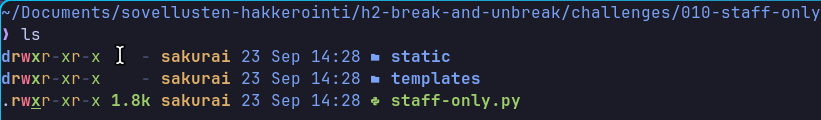

---

### Pakettien lataus

Yritin suorittaa kansion sisältä löytyneen Python-tiedoston ohjeiden mukaan, mutta järjestelmälläni ei ollut `python-flask-sqlalchemy` pakettia, joten latasin sen `pacman` packet managerilla, koska olen Arch-pohjaisella järjestelmällä (BTW).

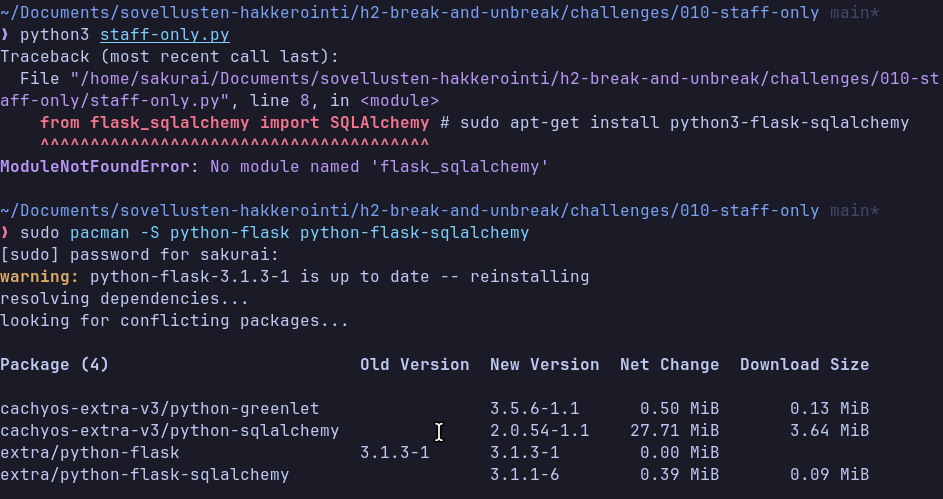


Suoritin tiedoston uudestaan ja dev serveri meni päälle kuvan alla olevaan osoitteeseen.

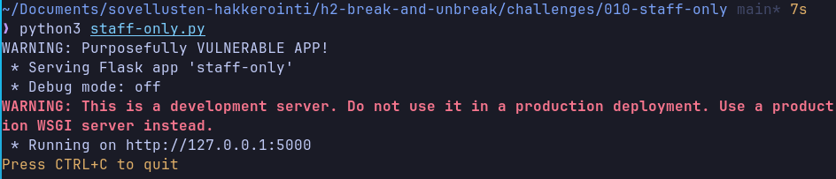

---

### Hakkerointi alkuun

Seuraavaksi aloitin hakkeroinnin annetussa osoitteessa, joka näytti aluksi tältä:

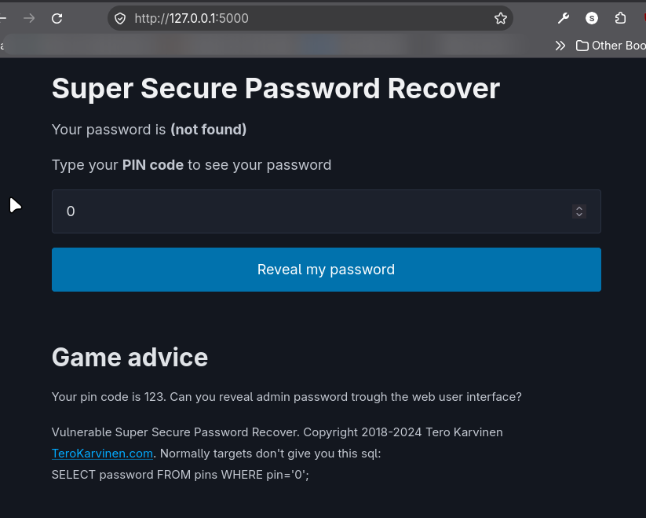

Pelin ohjeissa lukee, että PIN koodisi on 123, joka näyttää meidän salasanan, joka on **Somedude**.

Painamalla F12, avasin selaimen Inspector näkymän, josta näin sivun html-koodin. Sieltä huomataan, että sivusto ottaa syötteen vastaan seuraavalla tavalla:

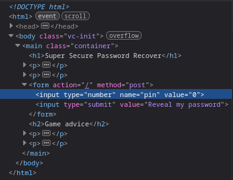


Vaihtamalla html input tyypin `text` muotoon, voimme syöttää salasanan teksti muodossa, joka auttaa meitä SQL-injektiota tehtäessä.

---

### SQL-injektio

Kokeilin perus SQL-injektio arvoa, jonka opin tunnilla `' OR 1=1--`. Tämä näytti salasanan olevan **foo**, joka antaa meille selkeän vihjeen siitä, että sovellus on murrettavissa, mutta meidän pitää näyttää oikealta riviltä salasana.

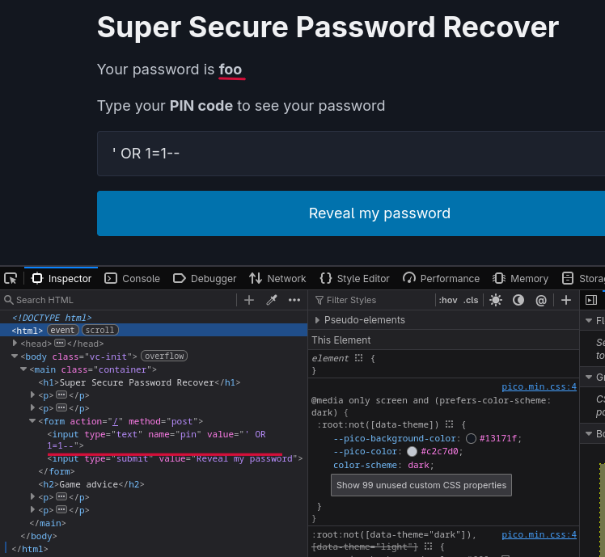


Tutkin hieman erilaisia SQL komentoja(?) ja löysin **LIMIT** komennon, jolla voidaan rajata kuinka monta riviä kyselymme saa näyttää, tämä ei kuitenkaan meitä auta tässä tehtävässä.

LIMIT komennolla on myös yksityiskohtaisempi käyttötarkoitus `LIMIT X OFFSET Y` tai `LIMIT Y, X`, jolla voimme spesifioida **X** luvulla, kuinka monta riviä palautamme, ja **Y** luvulla, kuinka monta riviä haluamme ohittaa kokonaan kyselyn palautuksessa.

Kokeilin ensin lisätä aikaisemman loppuun `LIMIT 1`, joka palautti saman **foo**, sen jälkeen `LIMIT 1, 1`, joka palautti **Somedude**.

Viimeisenä kokeilin `LIMIT 2, 1`, joka palautti oikean admin salasanan.

`SUPERADMIN%%rootALL-FLAG{Tero-e45f8764675e4463db969473b6d0fcdd}`

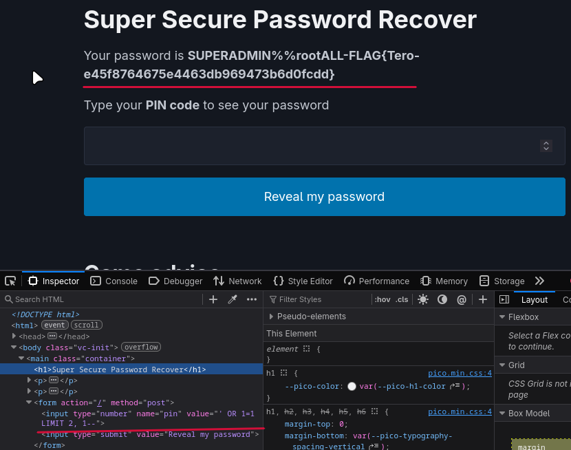

---

## b) Fix the 010-staff-only vulnerability from source code.

SQL-kysely käsitellään koodissa yhdistämällä pin merkkijono suoraan kyselyn muuttujaan.

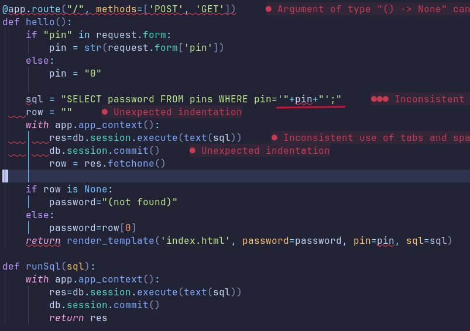
(Python indentation ei toiminut neovimissä sen takia niin paljon erroreita.)

Poistin pin-merkkijonon yhdistämisen suoraan kyselyyn ja annoin sen erillisenä parametrina myöhemmin.

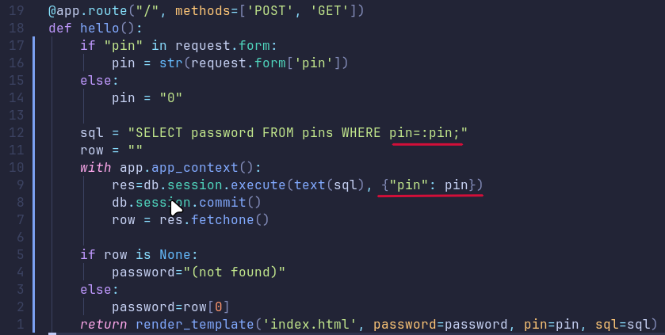

---

Uudella koodilla, jos yrität tehdä SQL-injektiota vastaukseksi tulee {not found}.

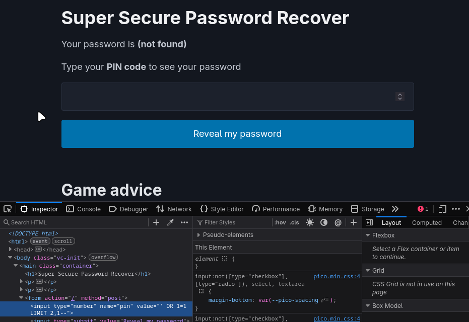

---

## c) Solve dirfuzt-1 from the article Karvinen 2023

Ensin latasin `ffuf` työkalun AUR-paketin yay:n avulla.

`yay -S ffuf`

Sitten latasin yleisiä web-polkuja sisältävän sanalistan.

`wget https://raw.githubusercontent.com/danielmiessler/SecLists/master/Discovery/Web-Content/common.txt`

Sen jälkeen latasin Teron artikkelin kautta **dirfuzt-1**, suoritettavan tehtävätiedoston ja annoin sille suoritus oikeudet `chmod u+x dirfuzt-1` komennolla, jonka jälkeen sen voi suorittaa.

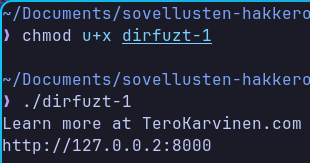

Verkko-osoitteen avaamalla selaimessa aukeaa seuraavanlainen sivu.

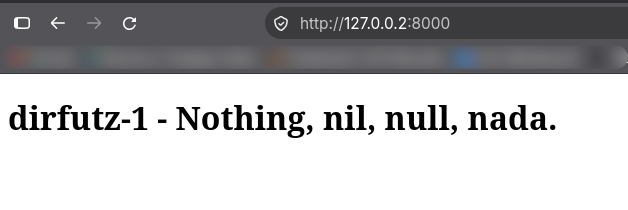

---

### FFUF käyttö

Ensimmäisenä käytin ffuf ohjelmaa ja seuraavanlaista komentoa `ffuf -w common.txt -u http://127.0.0.2:8000/FUZZ`, joka löytyi myös Teron omasta artikkelista.

Tämä komento tulosti 4752 riviä eri polun antamasta vastauksesta, jota en tietenkään aio kaikkea tähän lisätä kuvalla, mutta tulostuksen loppupää näytti tältä.

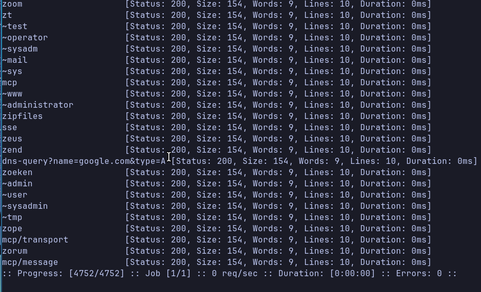

Siinä näkyy joitain testikohteita, tiedot jotka tulostuivat ovat **Status**, **Size**, **Words**, **Lines**, **Duration**.

Yleisin rivi mikä tulostui oli nimenomaan seuraava:

`[Status: 200, Size: 154, Words: 9, Lines: 10, Duration: 0ms`

---

### Filtteröidään tuloksia

Tunnilla puhuimme siitä, että mitä näistä kannattaisi ensin filtteröidä pois, ja se olisi nimeonmaan **Size** eli koko, koska sen muuttuminen merkitsee yleisesti jotain muutosta sisällössä. Käytin siihen seuraavaa komentoa.

`ffuf -w common.txt -u http://127.0.0.2:8000/FUZZ -fs 154`

Se tulosti seuraavat tiedot:

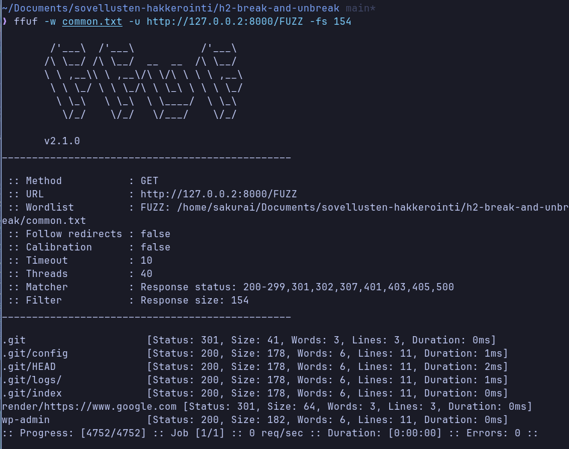

Tässä näkyvät kaikki pyynnöt, joissa oli eri koko kuin 154 tavua (bytes).

---

### Ratkaisun tarkistaminen

Tehtävässä piti löytää kaksi eri URL-päätettä. Admin-sivu ja versionhallinta-sivu. Joten testasin **.git** päätettä, sekä **wp-admin** päätettä.

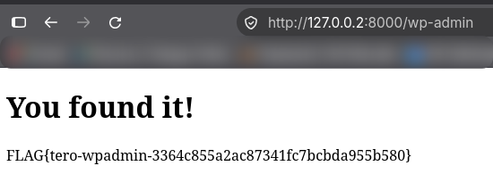
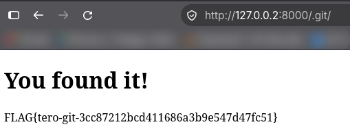

Molemmat sivut ja liput löytyivät näillä endpointeilla, joten tämä tehtävä on nyt ratkaistu.

```
.git lippu FLAG{tero-git-3cc87212bcd411686a3b9e547d47fc51}
wp-admin lippu FLAG{tero-wpadmin-3364c855a2ac87341fc7bcbda955b580}
```
```
```

---

## d) Break into 020-your-eyes-only Karvinen 2024.

Tämä haaste on jo ladattu, joten ohjeiden mukaan siirrytään 020-your-eyes-only kansioon ja ladataan **virtualenv** paketti.

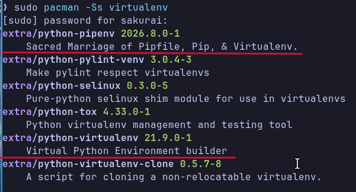

löysin seuraavat paketit ja `python-pipenv` kuulosti toimivalta, joten latasin sen `sudo pacman -S python-pipenv`.

---

### Avataan virtuaalinen ympäristö

Sitten suoritin komennot `virtualenv virtualenv/ -p python3 --system-site-packages` ja `source virtualenv/bin/activate`.

Tästä kuitenkin seurasi source... komennon kanssa virhe, koska käytin **fish** shelliä enkä bashia (oletan, että sitä haettiin).

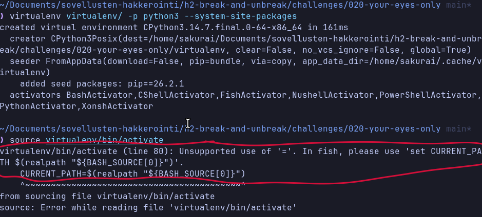

Löysin onnekseni **activate.fish** version skriptistä, joten käytin sitä.

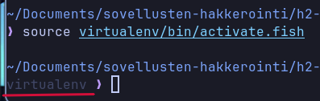

Huomaan, että virtual environment toimii, testataan vielä Teron ohjeiden mukaan, että kaikki on ok.

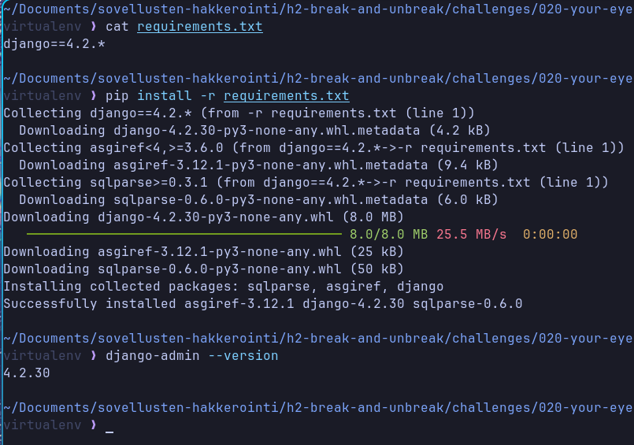

Kaikki näyttää toimivan ja django on nyt ladattu pip-työkalun avulla.

Seuraavaksi navigoidaan logtin/ kansioon.

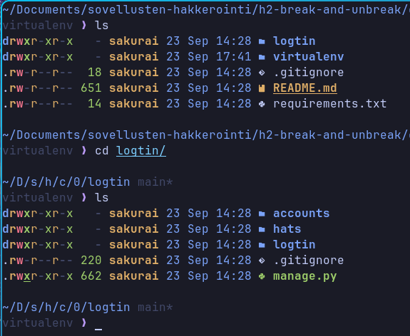

---

### Päivitetään tietokanta ja ajetaan testipalvelin

Päivitetään tietokanta `./manage.py makemigrations; ./manage.py migrate` komennolla.

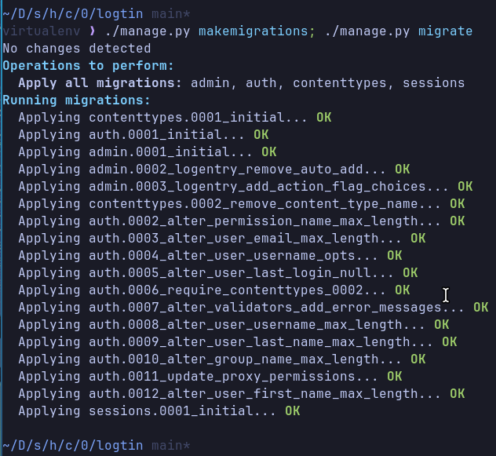

Seuraavaksi ajetaan testipalvelin.

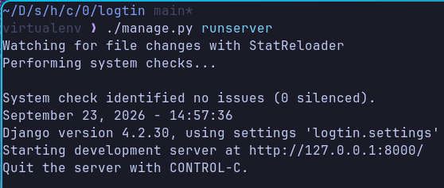

---

### Aletaan hakkeroimaan!

Palvelimen osoitteesta löytyy seuraavanlainen sivu.

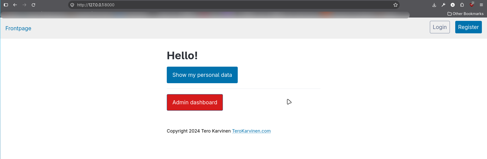

Tein sivustolle käyttäjän, ja kävin katsomassa "Show my personal data" välilehden.

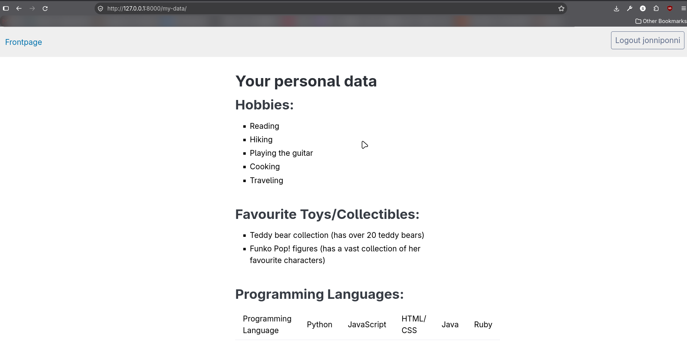

Tältä sivulta löytyi vain jotain placeholder tietoa.

Tämän jälkeen menin takaisin etusivulle ja testasin "Admin dashboard nappia".

Se vei minut **admin-dashboard/** -päätteeseen, jossa luki **403 Forbidden**.

Seuraavaksi aloin käyttämään taas **ffuf** -työkalua löytääkseni oikean admin consolen.

---

### FFUF käyttöön!

Minulla oli ideana, että haluaisin etsiä kaikki päätteet, jotka sisältää **admin** sanan (ja ovat common.txt sanalistassa) ja kysyin Claude (Sonnet 5) tekoälyltä, että miten voisin ffufilla tehdä tämän ja se antoi minulle seuraavan komennon.

`ffuf -w common.txt:FUZZ -u https://target.com/FUZZ -mr "admin"`

Tämä ei kuitenkaan tehnyt läheskään sitä mitä yritin selittää, joten filtteröin pois HTTP Statuksen **404**, joka palautti yhden päätepisteen **admin-console/**. Testasin mihin se vie.

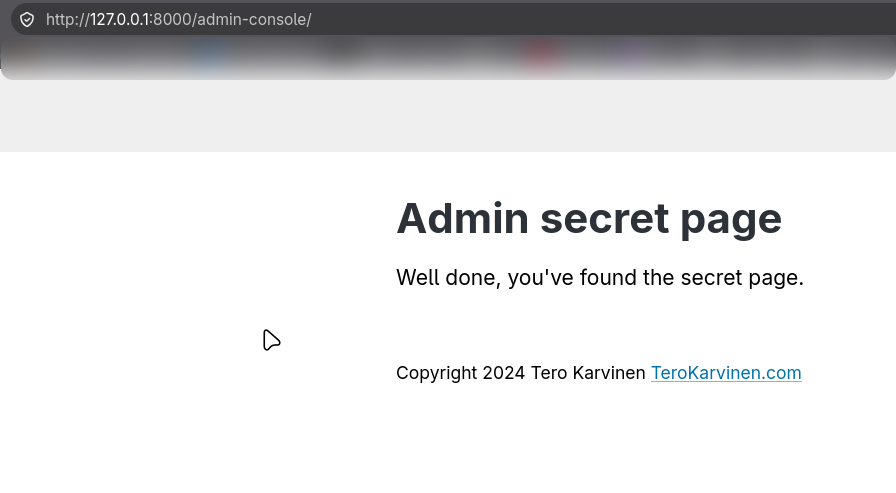

Admin Console löytyi, tehtävä on ratkaistu!

---

## e) Fix the 020-your-eyes-only vulnerability

Selailin kansioita läpi ja löysin **views/** kansiosta Python-tiedoston **views.py**, jossa oli seuraavat luokat, joilla tarkistettiin käyttäjän autentikaatio ja kuuluvatko he henkilöstöön.

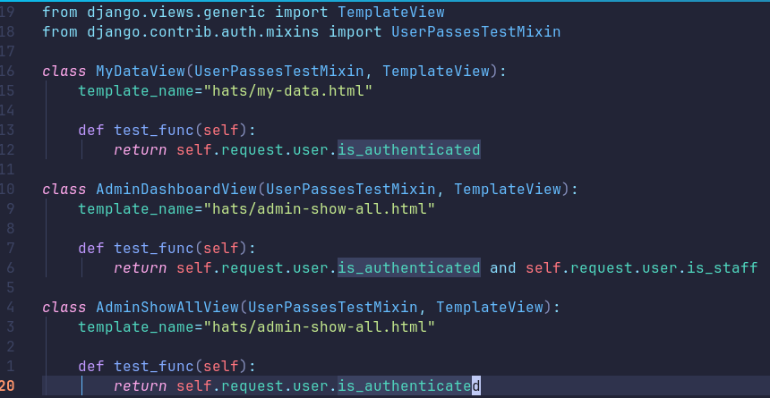

Koodista huomataan, että alimpaan luokkaan:

```
class AdminShowAllView(UserPassesTestMixin, TemplateView):
	template_name="hats/admin-show-all.html"

	def test_func(self):
		return self.request.user.is_authenticated
```
```
```

on unohdettu laittaa pyyntö tarkistaa, onko käyttäjä osa henkilöstöä.

Joten lisäsin loppuun `and self.request.user.is_staff`.

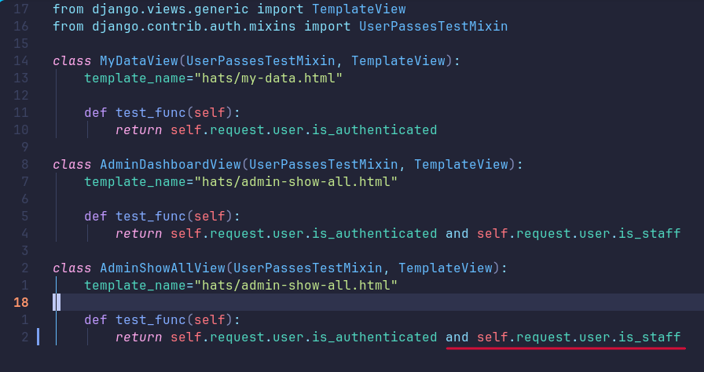

Korjauksen jälkeen ajoin palvelimen uudestaan ja testasin molemmat admin päätteet.

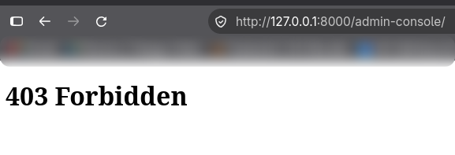

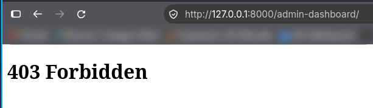

---

### Ratkaistu!

Nyt molemmat **admin-dashboard**, sekä **admin-console** päätteet tarkistaa, että käyttäjä on admin eikä päästä peruskäyttäjää sisään.

---

En tehnyt g) tai h) kohtaa ainakaan tässä vaiheessa kun oli kiire.

---

## Lähteet

[OWASP Top 10 sivu]("https://owasp.org/projects/top-ten") (Teron sivuilla oleva linkki ei toiminut)

[Karvinen 2023]("https://terokarvinen.com/2023/fuzz-urls-find-hidden-directories/")

[PortSwigger]("https://portswigger.net/web-security/access-control")

[Karvinen 2006]("https://terokarvinen.com/2006/raportin-kirjoittaminen-4/")
