# h3 No Strings Attached (Tero)

---

## a) Strings

Latasin ja siirsin `ezbin-challenges.zip` -tiedoston tehtäväkansioon ja purin sen `unzip` komennolla.

zip-tiedostosta purkaantui `challenges` -kansio, joka sisälsi `packd` ja `passtr` -kansiot.

`passtr` -kansiossa on suoritettava ohjelma `passtr`, joka on tarkoitus murtaa. 

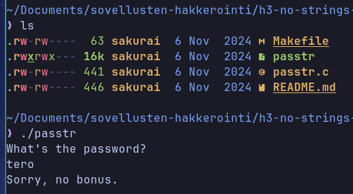

Ohjelma kysyy käyttäjältä salasanaa ja tarkastaa sen.

---

### Ratkaisu

Käytin `strings` -komentoa ja näen salasanan ja FLAGin sen avulla.

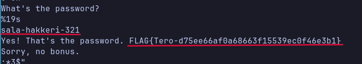

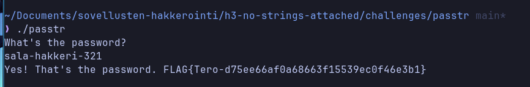

---

## b) C-ohjelman salasanan obfuskaatio

Aloin `passtr` ohjelman parantamisen tutkimalla erilaisia obfuskaatio metodeita.

Päädyin käyttämään salasanan XOR obfuskaatiota.

XOR (poissulkeva, tai exclusive or) on bittitason operaatio, jonka tulos on 1, kun vertailtavat bitit eroavat toisistaan, ja 0, kun ne ovat samat:

| A | B | A XOR B |
| --------------- | --------------- | --------------- |
| 0 | 0 | 0 |
| 0 | 1 | 1 |
| 1 | 0 | 1 |
| 1 | 1 | 0 |

C-kielessä operaattori on ^.

---

### XOR-apuohjelma

Kirjoitin ihan ensimmäisenä apuohjelman, jonka avulla sain obfuskoitua haluamani salasanan "hakkeri_ukko_543", sekä haluamani avaimen "obfus" muutettua hexadecimal -muotoon.

Sen koodi näyttää tältä:

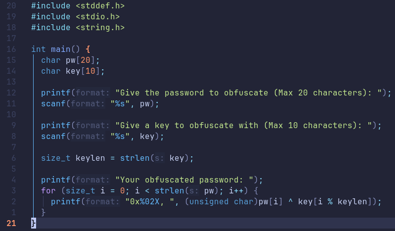

---

### Paremman passtr-ohjelman koodaaminen

Seuraavaksi aloin tekemään parannettua ohjelmaa `passtr_fixed`.

Ohjelma sisältää salasanan obfuskoidut tavut (bytes) `stored[]` constantissa ja XOR-avaimen (`obfus`), `key[]` constantissa.

Ohjelma lukee käyttäjän arvauksen `scanf`illä.

Ohjelma tarkistaa onko arvaus yhtä pitkä kuin salasana, jos ei niin ohjelma poistuu ennen silmukkaa.

Silmukka käy läpi kaikki 16 tavua. Se XORaa arvauksen tavun avaimen vastaavalla tavulla (`key[i % sizeof(key)]`) ja vertaa tulosta `stored[i]`:hen. Jos yksikin tavu poikkeaa, `match` asetetaan nollaksi ja silmukka keskeytetään.

Jos `match` on yhä 1, tulostetaan flägi, muuten epäonnistumisviesti.

Salasanaa ei siis koskaan rakenneta muistiin selväkielisenä, vaan arvaus obfuskoidaan ja verrataan tallennettuun.

`FLAG` tosin näkyy vielä binäärissä, mutta tehtävänannossa ei mainittu `FLAG`in piilottamisesta mitään.

Tässä koko ohjelman koodi:

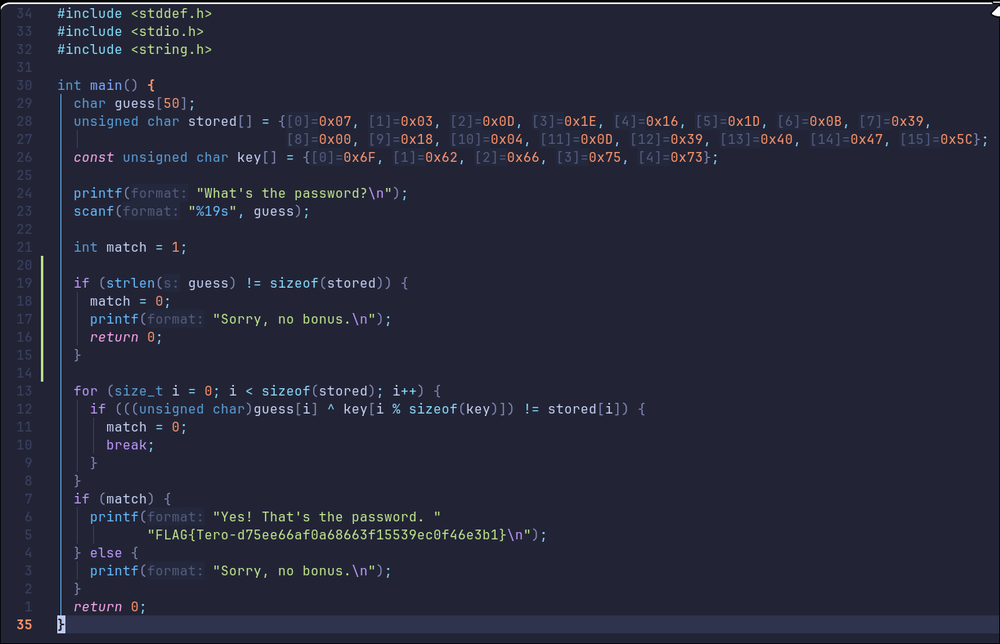

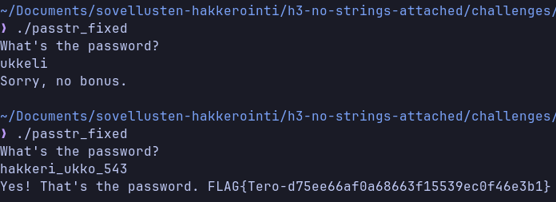

Salasana ei näy enää `strings` komennolla suoraan binäärissä.

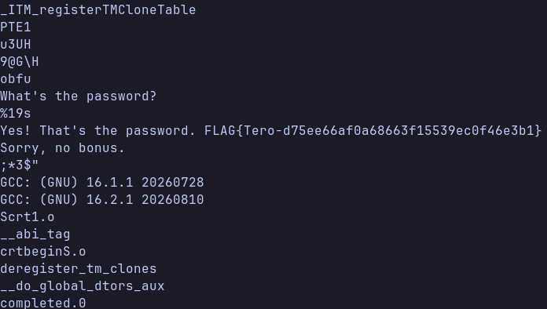

---

## c) Packd


`packd` -kansiossa on suoritettava ohjelma `packd`, jossa kysytään ohjelman salasanaa ja flägiä.

Ajoin ensin ohjelman ja kokeilin arvata salasanan.

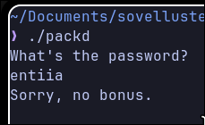

Ohjelma toimii samalla periaatteella kuin `passtr`: se kysyy salasanaa ja väärällä arvauksella tulostaa "Sorry, no bonus."

---

### Hypoteesi 1: salasana näkyy `strings` -komennolla

Koska a) kohdassa salasana löytyi suoraan `strings` -komennolla, kokeilin samaa ensimmäisenä.

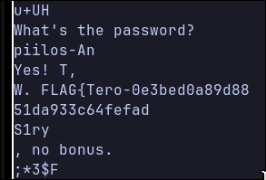

Tuloste näytti erikoiselta. Tekstit kuten "What's the password?" näkyivät kokonaisina, mutta salasana ja flägi olivat katkeilleet palasiksi: `piilos-An`, `Yes! T,`, `W. FLAG{Tero-0e3bed0a89d88`, `51da933c64fefad` ja `S1ry`, `, no bonus.`

Näistä pystyi jo arvaamaan, että salasana alkaa `piilos-An` ja flägi `FLAG{Tero-0e3bed0a89d88...`, mutta osa merkeistä puuttui. Päättelin, että binääri on jollain tavalla muokattu tai pakattu, joten `strings` ei näe sitä sellaisenaan.

---

### Hypoteesi 2: binääri on pakattu

Tarkistin tiedoston tyypin `file` -komennolla.

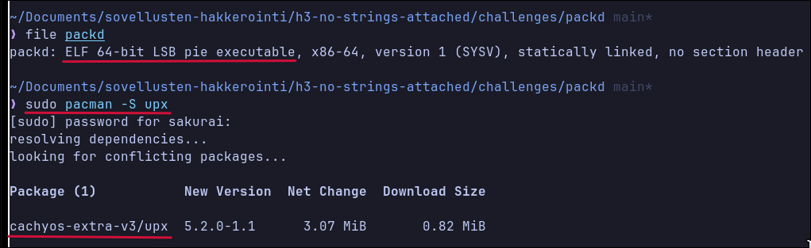

`file` kertoo, että kyseessä on `ELF 64-bit LSB pie executable`, joka on *statically linked* ja jolla ei ole *section headereita* (`no section header`). Tavallisesti `gcc`:llä käännetty ohjelma on dynaamisesti linkattu ja sisältää section headerit, joten tämä vahvisti epäilystä, että binääriä on käsitelty jälkikäteen.

Ohjelman nimi `packd` viittaa myös pakkaamiseen (packed). Kävin `strings packd` -tulostetta tarkemmin läpi ja sieltä löytyi vahvistus:

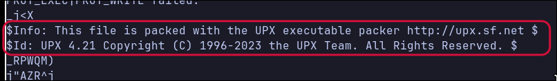

```
$Info: This file is packed with the UPX executable packer http://upx.sf.net $
$Id: UPX 4.21 Copyright (C) 1996-2023 the UPX Team. All Rights Reserved. $
```

Binääri on siis pakattu **UPX** (Ultimate Packer for eXecutables) -pakkaajalla. UPX pakkaa ohjelman koodin ja datan ja lisää alkuun pienen purkukoodin, joka purkaa ohjelman muistiin ajon aikana. Tästä syystä ohjelma toimii normaalisti, mutta levyllä oleva tiedosto on pakatussa muodossa.

Tämä selittää myös, miksi merkkijonot olivat katkeilleet: pakkausalgoritmi korvaa toistuvia tavusekvenssejä viittauksilla aiemmin esiintyneeseen dataan. Esimerkiksi salasanan loppu `AnAs` sisältää toistoa (`An` → `AnAn`), joten vain alku `piilos-An` jäi näkyviin selväkielisenä.

---

### Ratkaisu: UPX-purku

Asensin `upx` -työkalun paketinhallinnasta (kuva yllä):

```
sudo pacman -S upx
```

Tutkin käyttöohjeita `man upx` ja `upx --help` -komennoilla. Sieltä löytyi `-d` (decompress) -valitsin.

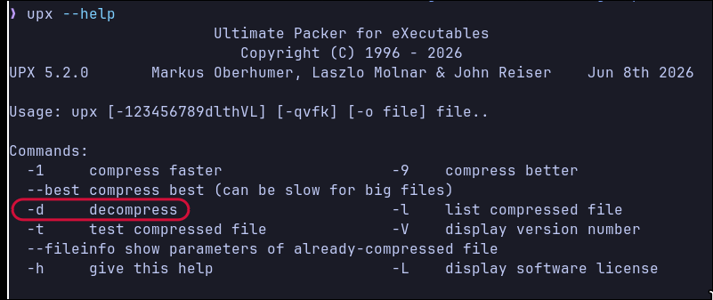

Purin binäärin:

```
upx -d packd
```

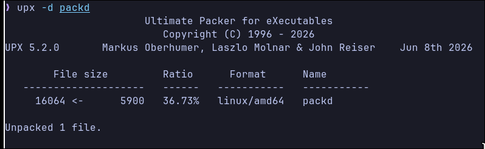

Tiedoston koko kasvoi 5900 tavusta 16064 tavuun (pakkaussuhde 36,73 %). Huomioitavaa on, että `upx -d` korvaa alkuperäisen tiedoston puretulla versiolla. Jos alkuperäinen pakattu versio halutaan säilyttää, kannattaa käyttää `-o` -valitsinta, esim. `upx -d packd -o packd_unpacked`.

---

Ajoin `strings` -komennon uudestaan puretulle binäärille:

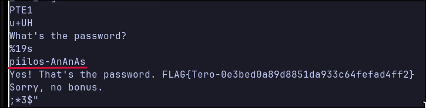

Nyt salasana ja flägi näkyivät kokonaisina. `%19s` -rivi kertoo myös, että ohjelma lukee `scanf`illä enintään 19 merkkiä.

Kokeilin salasanaa ohjelmaan:

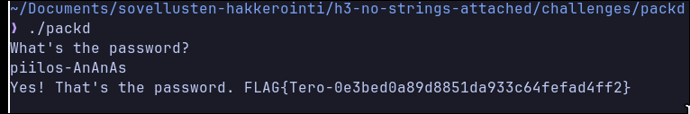

**Salasana:** `piilos-AnAnAs`

**Flägi:** `FLAG{Tero-0e3bed0a89d8851da933c64fefad4ff2}`

---

### Yhteenveto

| Vaihe | Komento | Havainto |
| --------------- | --------------- | --------------- |
| 1 | `./packd` | Ohjelma kysyy salasanaa |
| 2 | `strings packd` | Salasana ja flägi näkyvät vain palasina |
| 3 | `file packd` | Staattisesti linkattu, ei section headereita → käsitelty binääri |
| 4 | `strings packd` | Löytyi maininta UPX-pakkaajasta |
| 5 | `sudo pacman -S upx`, `man upx`, `upx --help` | Löytyi `-d` (decompress) |
| 6 | `upx -d packd` | Binääri purettu |
| 7 | `strings packd` | Salasana ja flägi näkyvät kokonaisina |
| 8 | `./packd` | Salasana toimii, flägi saatu |

Pakkaaminen ei siis ole varsinainen suojaus, vaan se ainoastaan hankaloittaa staattista analyysiä hetkellisesti. UPX-pakatun binäärin tunnistaa helposti ja sen voi purkaa samalla työkalulla, jolla se on pakattu.

---

## Lähteet

[Tehtävänanto](https://terokarvinen.com/application-hacking/#laksyt)

[XOR Cipher](https://www.geeksforgeeks.org/dsa/xor-cipher/)

[UPX](https://upx.github.io/)
