## x) Read/watch/listen and summarize

Katsoin John Hammondin videon, jossa hän käytti Ghidraa.

## a) Install Ghidra

Latasin Ghidran `sudo pacman -S ghidra` -komennolla.

## b) Rever-c

Latasin `ezbin-challenges.zip` -tiedoston ja purin sen `unzip` -komennolla

---

zip-tiedostossa olleessa `challenges` -kansiossa navigoin `packd` -kansioon ja löysin sieltä suoritettavan binääritiedoston.

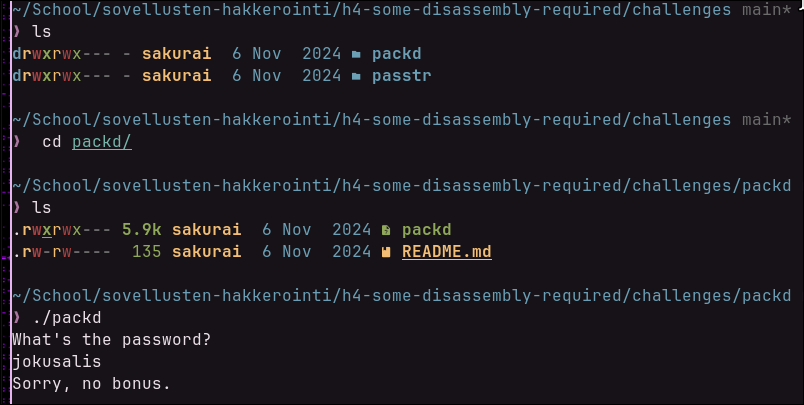

---

Seuraavaksi avasin binäärin Ghidrassa ja yriting etsiä main -funktion tehtävänannon mukaisesti.

En kuitenkaan saanut mitään selvää ohjelman funktio nimistä sun muista, joten päätin tarkistaa onko `packd` tiedosto pakattu jollain tavalla niinkuin h3-tehtävässä.

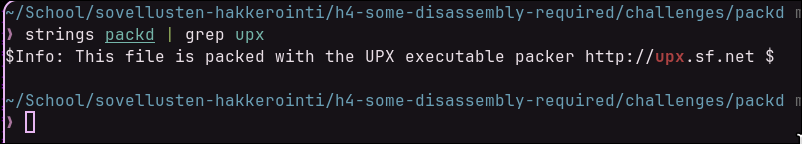

Kuten kuvassa näkyy `strings` ja `grep` -komennoilla nähdään, että tiedosto on pakattu UPX executable pakkausohjelmalla.

Purin tiedoston `upx -d packd` -komennolla ja menin tutkimaan purettua versiota Ghidraan.

---

Nyt kun binääri oli purettu `main` -funktion löysin helposti Symbol Tree:n "Functions" näkymästä.

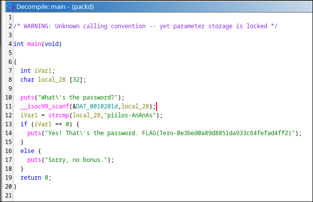

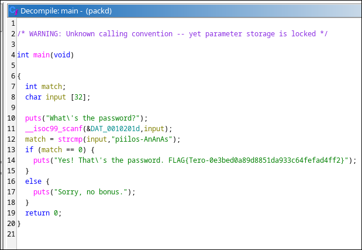

Annoin ohjelman muuttujille niiden tarkoituksia kuvaavat nimet.

Ohjelman toiminta on seuraavanlainen: Ohjelma kysyy käyttäjältä salasanaa ja ottaa käyttäjältä syötteen, jota se vertaa ohjelman oikeaan salasanaan, jos käyttäjän antama salasana on väärä, ohjelma tulostaa "Sorry, no bonus." ja "Yes! That\'s the password. FLAG{Tero-0e3bed0a89d8851da933c64fefad4ff2}", jos se on oikein.

Tehtävä on nyt suoritettu.

---

## c) If backwards

Tämän saa tehtyä yhtä arvoa muuttamalla, jos muutamme if -lausekkeen `(match == 0)`, `(match == 1)`, ohjelma antaa myöntävän vastauksen aina, kun käyttäjä syöttää väärän salasanan ja kielteisen vastauksen vain, jos käyttäjä antaa oikean salasanan.

Tai tämä oli ainakin ensimmäinen hypoteesini, ennen kuin tajusin, että en voi vaan muuttaa koodia decompiler näkymässä, vaan minun pitää muuttaa itse Assembly -koodia.

Ghidrassa Assembly koodia muutetaan listing näkymässä halutun viivan kohdalta klikkaamalla oikealla hiiren napilla ja valitsemalla `Patch instruction` valikosta, jonka jälkeen pääset muokkaamaan ohjeita.

Katsoin Assembly -kielen ohjeita ja näin `JNZ` (Jump if Not Zero) ohjeen ohjelman binäärissä, joka siirtyy tiettyyn muistiosoitteessen jos Zero Flag (ZF) on 0 ja ohjelma ei siirry, jos se on 1.

Tämän ohjeen vastakohta on `JZ` (Jump if Zero), joten käytin sitä `JNZ` sijasta.

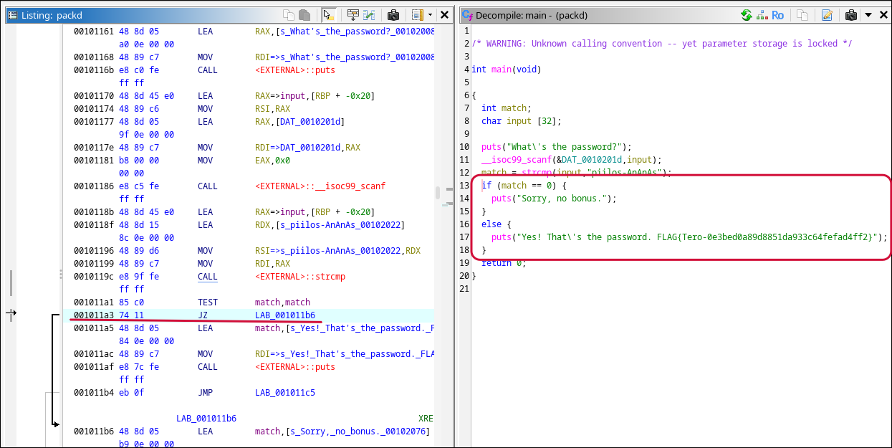

Eli periaatteessa hypoteesini oli lähes oikein, mutta koodin muutos piti tehdä eri tavalla kuin ajattelin aluksi mahdolliseksi Ghidralla ja muutos oli hieman erilainen.

---

Exporttasin muutetun ohjelman ja tein siitä suoritettavan `chmod +x` -komennolla.

Testasin myös toimiiko uusi ohjelma toivotulla tavalla

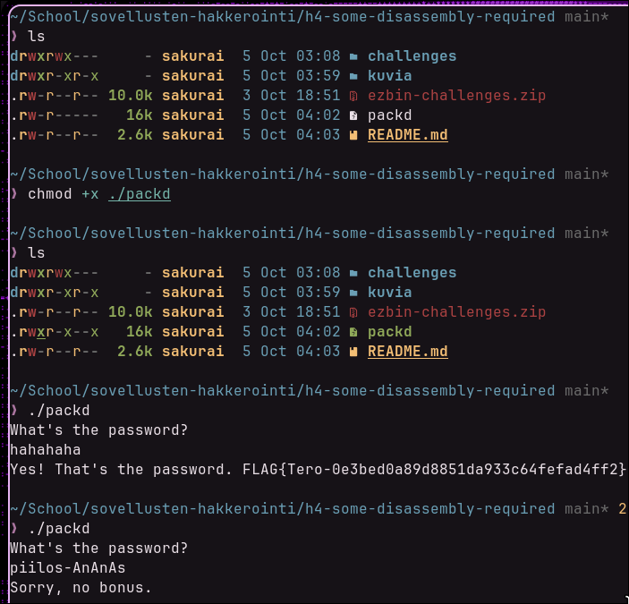

Uusi ohjelma toimii nyt toivotulla tavalla ja tehtävä on suoritettu.

---

## d) Nora CrackMe

Kloonasin GitHubista Nora CrackMe -tiedostot `git clone git@github.com:NoraCodes/crackmes.git` -komennolla.

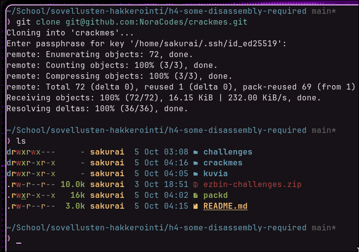

`crackmes/` -kansiossa oli C-ohjelmia, jotka muutetaan suoritettaviksi ohjelmiksi `make <name>` -komennolla, jossa <name> on "crackme" ja haluttavan ohjelman numero (esim 01 jne.).

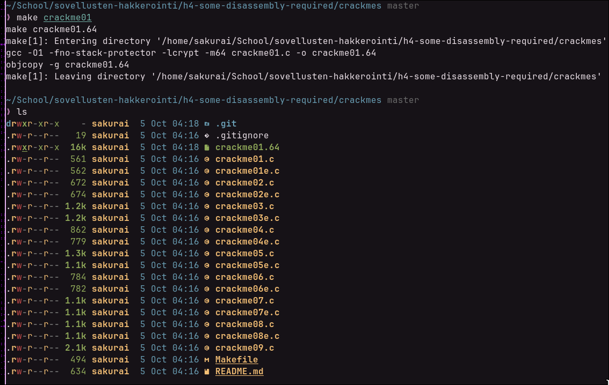

---

## e) Nora crackme01

d) osiossa olin jo muuttanut `crackme01.c` -ohjelman suoritettavaksi `make` -komennolla, joten suoritin sen ja katsoin mitä se tekee.

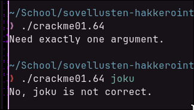

Ohjelma tarvitsee yhden argumentin, joka on salasana, jolla saa jonkin vastauksen. En tiedä salasanaa vielä tässä vaiheessa, joten en saanut sitä oikein.

---

Avasin ohjelman binäärin Ghidrassa ja nimesin `main` -funktion muuttujat uudestaan.

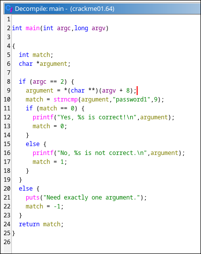

Ohjelmassa on käytetty `strncmp()` -funktiota, jossa verrataan käyttäjän antamaa argumenttia ja merkkijonoa "password1", ja maksimi määrä verrattavia merkkejä on 9.

Kokeilin antaa "password1" ohjelman argumentiksi ja se oli oikea salasana ja sain seuraavan tulostuksen.

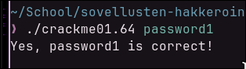

Crackme01 on nyt murrettu.

---

## e) Nora crackme01e.

`crackme01e` on samanlainen ohjelma kuin `crackme01` ainakin tulostuksiltaan.

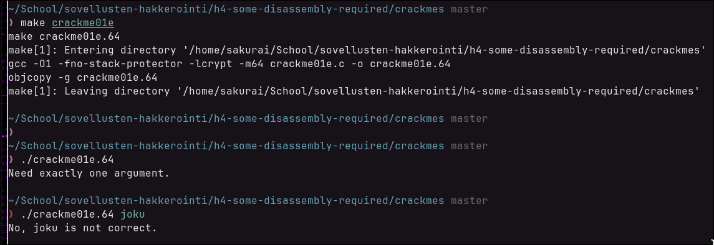

Menin Ghidraan tutkimaan binääriä ja annoin muuttujille kuvaavat nimet jälleen.

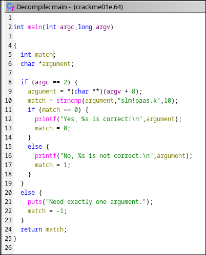

Ohjelma näytti muuten täysin samalle, mutta oikea salasana oli tällä kertaa "slm!paas.k".

Kokeilin antaa ohjelmalle tämän merkkijonon argumentiksi.

Tämä merkkijono oli oikea salasana ja tämäkin ohjelma antoi saman tulostuksen.

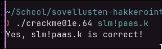

Tämäkin ohjelma on nyt murrettu.

---

## f) Nora crackme02

Käytin jälleen `make` -komentoa saadakseni suoritettavan binäärin `crackme02.c` -ohjelmasta.

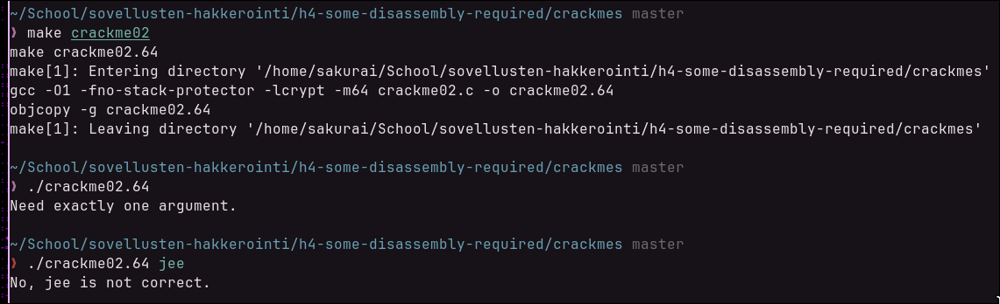

Ohjelma oli samanlainen kuin `crackme01` -ohjelmat. Menin tutkimaan binääriä jälleen Ghidrassa.

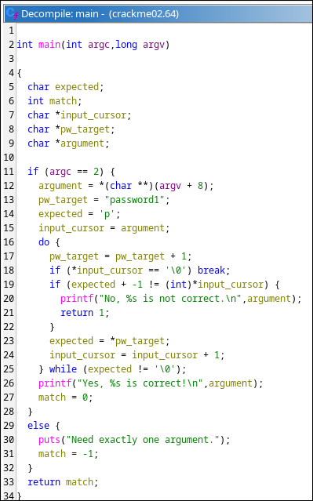

Tässä kohtaa tutkin koodia ja minulle oli aika selkeitä kaikki muut muuttujat paitsi tuo, jonka nimesin `input_cursor`. Kysyin Claude Sonnet 5.5 tekoälymallilta mikä se voisi olla, ja se antoi minulle tuon vastauksen.

Lyhyesti ja yksinkertaisesti selitettynä ohjelman toiminta on seuraavanlainen:

- Jos argumentteja ei ole tasan yksi, tulostuu "Need exactly one argument." ja ohjelma palauttaa -1.
- Muuten silmukka käy läpi salasanan merkit. Jokaisen syöteen merkin on oltava salasanan vastaava merkki miinus yksi (ASCII-arvo). Esimerkiksi `p` -> `p` ja `a` -> `.
- Jos merkki ei täsmää, tulostuu "No ... is not correct." ja ohjelma palauttaa 1.
- Jos kaikki merkit täsmäävät, tulostuu "Yes ... is correct!" ja ohjelma palauttaa 0.

Oikea syöte on siis: "o\`rrvnqc0" (eli `password1`, jonka jokaista merkkiä on pienennetty yhdellä).

| # | Salasanan merkki | ASCII | −1 | Syötteen merkki |
|---|---|---|---|---|
| 1 | `p` | 112 | 111 | `o` |
| 2 | `a` | 97 | 96 | `` ` `` |
| 3 | `s` | 115 | 114 | `r` |
| 4 | `s` | 115 | 114 | `r` |
| 5 | `w` | 119 | 118 | `v` |
| 6 | `o` | 111 | 110 | `n` |
| 7 | `r` | 114 | 113 | `q` |
| 8 | `d` | 100 | 99 | `c` |
| 9 | `1` | 49 | 48 | `0` |
(Tämän taulukon on tehnyt Claude)

Kokeilin käyttää tätä salasanaa ohjelman argumenttina.

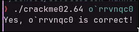

Salasana oli oikea ja ohjelma on murrettu.

---

Katson myöhemmin teenkö loput vapaaehtoiset tehtävät, mutta en ainakaan tässä vaiheessa.

---

## Lähteet

[Editing an Executable Binary File With Ghidra](https://blog.cjearls.io/2019/04/editing-executable-binary-file-with.html)

[Tehtävänanto](https://terokarvinen.com/application-hacking/)

Claude Sonnet 5.5 tekoälymallia hyödynnetty Markdown taulukon tekemisessä ja lyhyesti crackme02 ratkaisemisessa.
