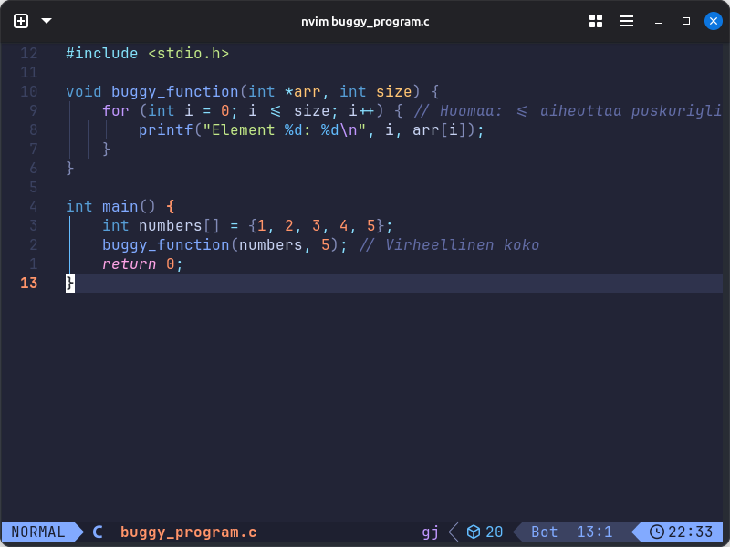
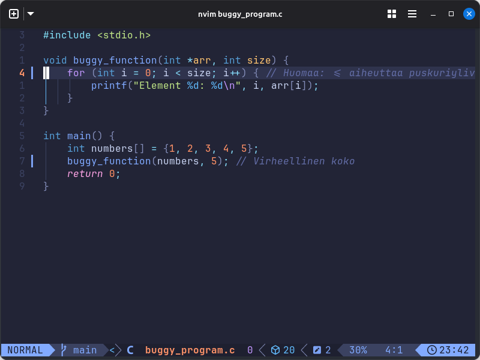
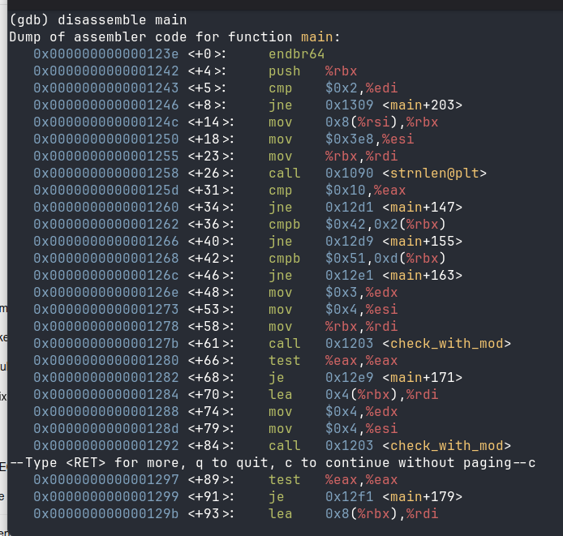
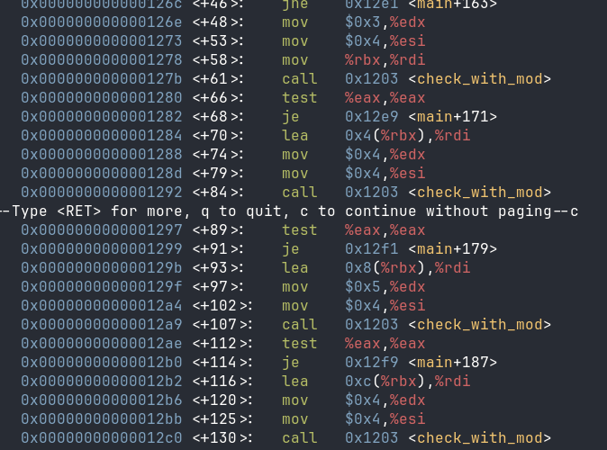
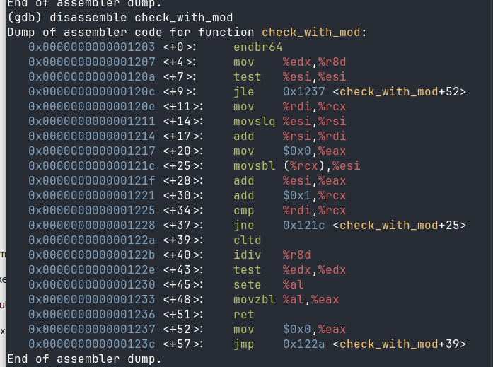
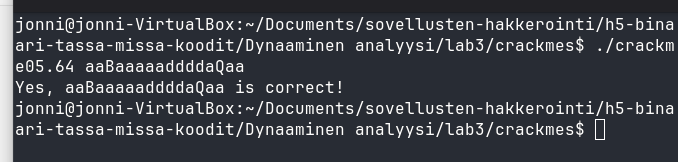

## lab0

Alkuperäinen koodi on virheellinen, koska funktiota kutsuessa koko on 5, kun oikeasti taulukon viimeisen arvon indeksi on 4, koska taulukko alkaa 0:sta.



Korjasin koodin vaihtamalla buggy_functionissa olevan loopin lopetusehdon <=:stä pelkkään <.



## lab1

## lab2

## lab3

Ratkaisin tähän osioon `crackme05` ohjelman.

Ensimmäisenä voimme tarkastella main funktion ohjeita 'disassemble main' komennolla.



Me näämme main funktion ohjeista, että salasanan pituuden täytyy olla 16 merkkiä.

```
call strnlen
cmp $0x10, %eax // vertaa string pituutta kuuteentoista
jne fail
```

Toinen salasanan vaatimus on, että 2 indeksin arvon täytyy olla 'B' kirjain.

```
cmpb $0x42, 0x2(%rbx) ; 0x42 = 'B' ASCII:ssa.
```

Kolmas vaatimus salasanalle on, että  13 indeksin arvon täytyy olla 'Q' kirjain.

```
cmpb $0x51, 0xd(%rbx) ; 0x51 = 'Q' ASCII:ssa.
```

Salasanan oletettu layout on nyt:

0 1 2 3 4 5 6 7 8 9 A B C D E F
? ? B ? ? ? ? ? ? ? ? ? ? Q ? ?

(16 characters indexed 0–15.)

---

Voimme ymmärtää miten check_with_mod funktiota hyödynnetään ohjelmassa tarkastelemalla sen kutsuja main funktiossa.



```
mov %rbx,%rdi      ; pointer into password
mov $0x4,%esi      ; length
mov $0x3,%edx      ; modulus?
call check_with_mod
```

```
lea 0x4(%rbx),%rdi
mov $4,%esi
mov $4,%edx
call check_with_mod
```

```
lea 0x8(%rbx),%rdi
mov $4,%esi
mov $5,%edx
call check_with_mod
```

```
lea 0xc(%rbx),%rdi
mov $4,%esi
mov $4,%edx
call check_with_mod
```

Tämä jakaa salasanan neljään osioon:

| Block | Characters | Arguments |
| ----- | --------------- | --------------- |
| 1 | password[0..3] | check_with_mod(ptr, 4, 3) |
| 2 | password[4..7] | check_with_mod(ptr, 4, 4) |
| 3 | password[8..11] | check_with_mod(ptr, 4, 5) |
| 4 | password[12..15] | check_with_mod(ptr, 4, 4) |

Jokaisen osion täytyy palauttaa `check_with_mod()` funktiosta muun kuin nollan.

---

Seuraavaksi voimme tarkastella itse check_with_mod funktiota 'disassemble check_with_mod' komennolla.



### Mitä `check_with_mod` tekee

Käännettynä C-kieleen se on suunnilleen tällainen:

```
int check_with_mod(char *ptr, int len, int mod)
{
    int sum = 0;

    for (int i = 0; i < len; i++)
    {
        sum +=  (signed char)ptr[i];
    }

    return (sum % mod) == 0;
}
```

Eli jokaiselle 4-merkin osiolle

- Lisää ASCII arvot.
- Jaa annetulla moduluksella.
- Jäännöksen **täytyy olla 0**.

---

Kaikki vaatimukset yhdessä

|  Positions  |  Constraint  |
|--------------- | --------------- |
| 0-3 |  ASCII sum divisible by **3**.  |
| 4-7 |  ASCII sum divisible by **4**.  |
| 8-11 |  ASCII sum divisible by **5**.  |
| 12-15 |  ASCII sum divisible by **4**.  |
| 2 | Must be **B** (ASCII 66). |
| 13 | Must be **Q** (ASCII 81). |
| Length | Exactly **16** characters. |

---

**Oikean salasanan rakennus**

Valitaan tulostettavat kirjaimet

**Block 1 (positions 0-3)**

Tarvitaan:

$`a + b + 66 + d = 0 (mod 3)`$

Valitaan a a B a:

- 97 + 97 + 66 + 97 = **357**
- 357 / 3 = 119 jäännös **0** 

**Block 2 (positions 4-7)**

Valitaan aaaa:

- 97 x 4 = **388**
- 388 voi jakaa **4**:llä

**Block 3 (positions 8-11)**

Valitaan dddd:

- 100 x 4 = **400**
- 400 voi jakaa **5**:llä

**Block 4 (positions 12-15)**

Tarvitaan merkki 13 = Q.

Valitaan aQaa:

- 97 + 81 + 97 + 97 = **372**
- 372 voi jakaa **4**:llä

---

**Mahdollinen salasana**

**aaBaaaaaddddaQaa**

Tämä täyttää **kaikki tarkastukset** main-funktiossa.

**Varmistetaan summien eheys**

| Block | Sum | Result |
| --------------- | --------------- | --------------- |
| aaBa | 357 | $`357 mod 3 = 0`$ |
| aaaa | 388 | $`388 mod 4 = 0`$ |
| dddd | 400 | $`400 mod 5 = 0`$ |
| aQaa | 372 | $`372 mod 4 = 0`$ |

Testataan onko mahdollinen salasana vastaus ohjelmaan.



Salasana on oikein ja tämä tehtävä on nyt ratkaistu!
