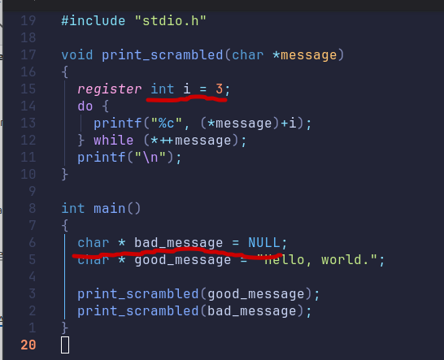
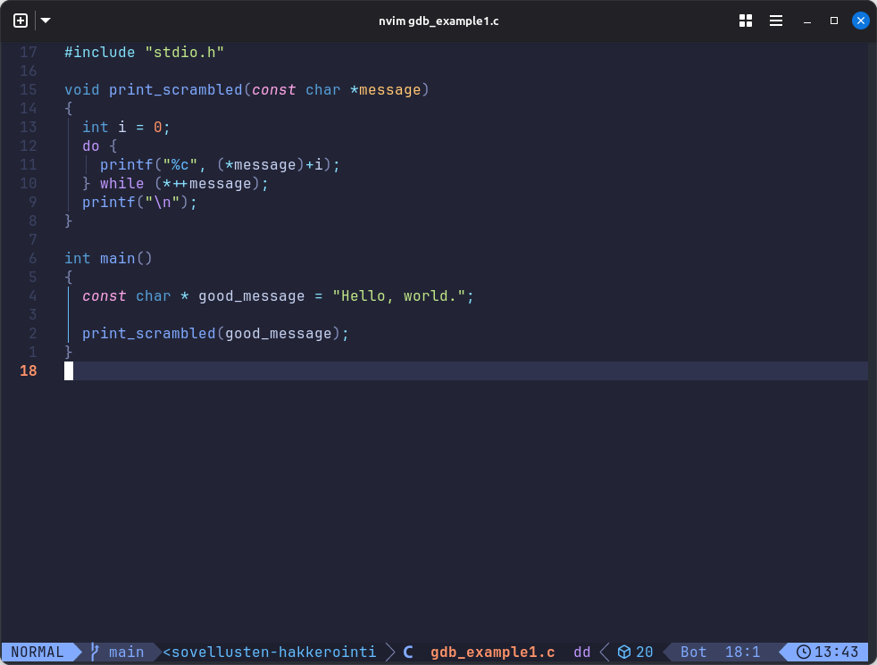
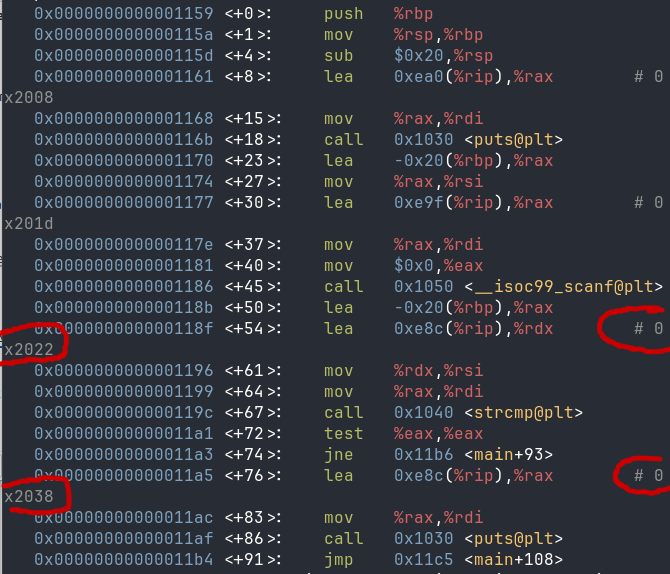
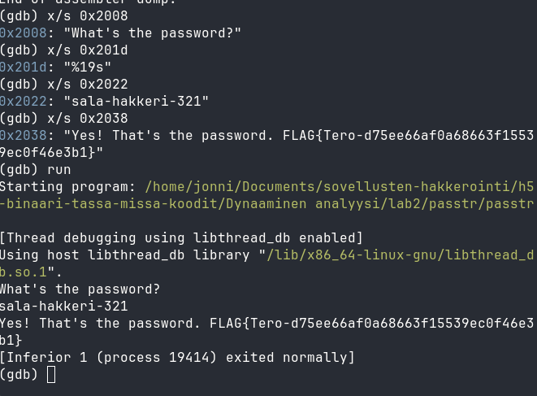
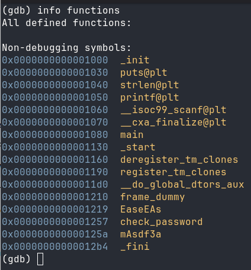
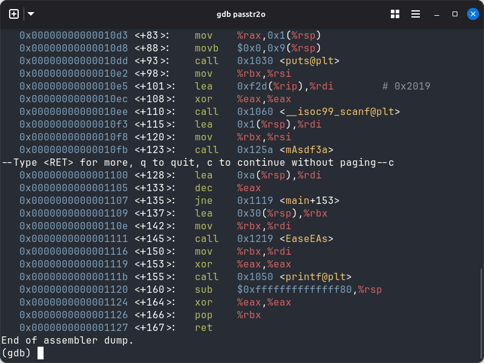
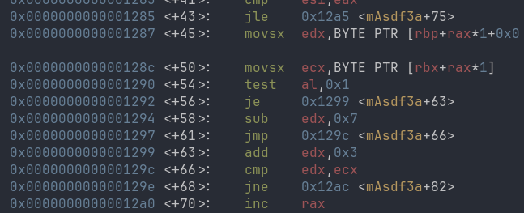
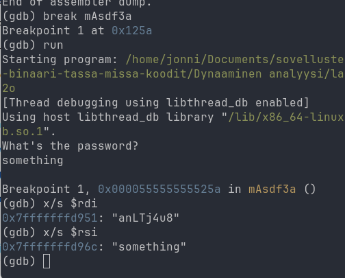
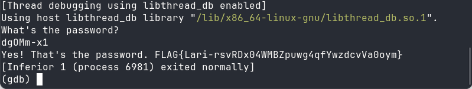

## **lab0**

Alkuperäinen koodi on virheellinen, koska funktiota kutsuessa koko on 5, kun oikeasti taulukon viimeisen arvon indeksi on 4, koska taulukko alkaa 0:sta.


Korjasin koodin vaihtamalla buggy_functionissa olevan loopin lopetusehdon <=:stä pelkkään <.


---

## **lab1**

Alkuperäisessä koodissa oli melko paljon ongelmia, jotka huomasin ja pystyin korjaamaan pelkästään lähdekoodia tutkimalla.



Korjasin nämä kohdat ja muutin myös good_message constantiksi, jotta compiler ei valittanut siitä.



---

## **lab2**

Tässä tehtävässä ensimmäisen salasanan ja FLAGin voisi periaatteessa katsoa vain lähdekoodista, mutta ne saa selville myös debuggerin avulla.

katsoin mihin muistisijainteihin main funktiossa muuttujia talletettiin ja katsoin mitä niistä löytyi saadakseen selville salasanan ja FLAGin.



---



Ensimmäisen ohjelman salasana on siis '**sala-hakkeri-321**' ja ensimmäinen FLAG on '**Tero-d75ee66af0a68663f15539ec0f46e3b1**'.

---

### **passtr2o ohjelman crackkaaminen**

Seuraava FLAG sijaitsi passtr2o ohjelmassa, jonka lähdekoodia ei ollut hallussa, salasana ja FLAG piti siis saada selville pelkän debuggerin avulla.

### **Ohjelman funktioiden selvittäminen**

Ensimmäinen asia minkä katsoin oli mitä funktioita ohjelmassa oli `info functions` komennolla.



---

### **Main-funktion tutkiminen**

Seuraavaksi katsoin mitä main funktio pitää sisällään `disassemble main` komennolla.



Tästä voidaan päätellä, että `scanf` lukee käyttäjän syötteen ja tämän jälkeen syöte välitetään `mAsdf3a`-funktiolle.

---

### **Salasanan tarkistusfunktion analysointi**

Seuraavaksi tarkistin funktion:
`disassemble mAsdf3a`



Kuvassa näkyy funktion meille tärkein osa.

Funktiolle annetaan kaksi merkkijonoa:

- `RDI` sisältää ensimmäisen merkkijonon.
- `RSI` sisältää toisen merkkijonon.

Tämän voi todentaa GDB:ssä asettamalla breakpointin funktioon:
`break mAsdf3a`
`run`

Kun ohjelma pysähtyy, argumentit voi tarkistaa:

`x/s $rdi`
`x/s $rsi`



---

### **Binäärissä olevan vertailumerkkijonon selvittäminen**

`main`-funktion alussa oleva assembly sisälsi seuraavan:

```
movabs %rax, 0x3875346a544c6e61
mov %rax, 0x1(%rsp)
movb $0x0, 0x9(%rsp)
```
```
```

Koska x86_64 käyttää little-endian muotoa, muistissa tavut ovat päinvastaisessa järjestyksessä kuin rekisterissä näkyvä heksaluku.

Arvo:
`0x3875346a544c6e61`

tallentuu muistiin seuraavina tavuina:
`61 6e 4c 54 6a 34 75 38`

ASCII-muodossa tämä on:
`anLTj4u8`

Tämä ei kuitenkaan ollut suoraan oikea salasana.

---

### **Salasanan muunnoksen selvittäminen**

`mAsdf3a` käsittelee merkit indeksin perusteella.

Assemblyssä:
```
test $0x1, %al
je  ...
sub $0x7, %edx
```

Jos indeksin alin bitti on 1, eli indeksi on pariton, merkkikoodista vähennetään `7`.

Parillisella indeksillä suoritetaan:
`add $0x3, %edx`

Eli algoritmi on:

```
parillinen indeksi -> merkki + 3
pariton indeksi -> merkki - 7
```

Binäärissä merkkijono oli:
`anLTj4u8`

Muunnettaessa jokainen merkki saadaan:

| Indeksi | Alkuperäinen | Operaatio | Tuloksena |
| --------------- | --------------- | --------------- | --------------- |
| 0 | a | +3 | d |
| 1 | n | -7 | g |
| 2 | L | +3 | O |
| 3 | T | -7 | M |
| 4 | j | +3 | m |
| 5 | 4 | -7 | - |
| 6 | u | +3 | x |
| 7 | 8 | -7 | 1 |

Näin saadaan oikeaksi salasanaksi:
`dgOMm-x1`

Tämä voidaan varmistaa suorittamalla ohjelma ja syöttämällä salasana:
`dgOMm-x1`



---

## **lab3**

Ratkaisin tähän osioon `crackme05` ohjelman.

Ensimmäisenä voimme tarkastella main funktion ohjeita 'disassemble main' komennolla.


Me näämme main funktion ohjeista, että salasanan pituuden täytyy olla 16 merkkiä.

```
call strnlen
cmp $0x10, %eax // vertaa string pituutta kuuteentoista
jne fail
```

Toinen salasanan vaatimus on, että 2 indeksin arvon täytyy olla 'B' kirjain.

```
cmpb $0x42, 0x2(%rbx) ; 0x42 = 'B' ASCII:ssa.
```

Kolmas vaatimus salasanalle on, että  13 indeksin arvon täytyy olla 'Q' kirjain.

```
cmpb $0x51, 0xd(%rbx) ; 0x51 = 'Q' ASCII:ssa.
```

Salasanan oletettu layout on nyt:

0 1 2 3 4 5 6 7 8 9 A B C D E F

? ? B ? ? ? ? ? ? ? ? ? ? Q ? ?

(16 characters indexed 0–15.)

---

Voimme ymmärtää miten check_with_mod funktiota hyödynnetään ohjelmassa tarkastelemalla sen kutsuja main funktiossa.


```
mov %rbx,%rdi      ; pointer into password
mov $0x4,%esi      ; length
mov $0x3,%edx      ; modulus?
call check_with_mod
```

```
lea 0x4(%rbx),%rdi
mov $4,%esi
mov $4,%edx
call check_with_mod
```

```
lea 0x8(%rbx),%rdi
mov $4,%esi
mov $5,%edx
call check_with_mod
```

```
lea 0xc(%rbx),%rdi
mov $4,%esi
mov $4,%edx
call check_with_mod
```

Tämä jakaa salasanan neljään osioon:

| Block | Characters | Arguments |
| ----- | --------------- | --------------- |
| 1 | password[0..3] | check_with_mod(ptr, 4, 3) |
| 2 | password[4..7] | check_with_mod(ptr, 4, 4) |
| 3 | password[8..11] | check_with_mod(ptr, 4, 5) |
| 4 | password[12..15] | check_with_mod(ptr, 4, 4) |

Jokaisen osion täytyy palauttaa `check_with_mod()` funktiosta muun kuin nollan.

---

Seuraavaksi voimme tarkastella itse check_with_mod funktiota 'disassemble check_with_mod' komennolla.


### Mitä `check_with_mod` tekee

Käännettynä C-kieleen se on suunnilleen tällainen:

```
int check_with_mod(char *ptr, int len, int mod)
{
    int sum = 0;

    for (int i = 0; i < len; i++)
    {
        sum +=  (signed char)ptr[i];
    }

    return (sum % mod) == 0;
}
```

Eli jokaiselle 4-merkin osiolle

- Lisää ASCII arvot.
- Jaa annetulla moduluksella.
- Jäännöksen **täytyy olla 0**.

---

Kaikki vaatimukset yhdessä

|  Positions  |  Constraint  |
|--------------- | --------------- |
| 0-3 |  ASCII sum divisible by **3**.  |
| 4-7 |  ASCII sum divisible by **4**.  |
| 8-11 |  ASCII sum divisible by **5**.  |
| 12-15 |  ASCII sum divisible by **4**.  |
| 2 | Must be **B** (ASCII 66). |
| 13 | Must be **Q** (ASCII 81). |
| Length | Exactly **16** characters. |

---

**Oikean salasanan rakennus**

Valitaan tulostettavat kirjaimet

**Block 1 (positions 0-3)**

Tarvitaan:

$`a + b + 66 + d = 0 (mod 3)`$

Valitaan a a B a:

- 97 + 97 + 66 + 97 = **357**
- 357 / 3 = 119 jäännös **0** 

**Block 2 (positions 4-7)**

Valitaan aaaa:

- 97 x 4 = **388**
- 388 voi jakaa **4**:llä

**Block 3 (positions 8-11)**

Valitaan dddd:

- 100 x 4 = **400**
- 400 voi jakaa **5**:llä

**Block 4 (positions 12-15)**

Tarvitaan merkki 13 = Q.

Valitaan aQaa:

- 97 + 81 + 97 + 97 = **372**
- 372 voi jakaa **4**:llä

---

**Mahdollinen salasana**

**aaBaaaaaddddaQaa**

Tämä täyttää **kaikki tarkastukset** main-funktiossa.

**Varmistetaan summien eheys**

| Block | Sum | Result |
| --------------- | --------------- | --------------- |
| aaBa | 357 | $`357 mod 3 = 0`$ |
| aaaa | 388 | $`388 mod 4 = 0`$ |
| dddd | 400 | $`400 mod 5 = 0`$ |
| aQaa | 372 | $`372 mod 4 = 0`$ |

Testataan onko mahdollinen salasana vastaus ohjelmaan.


Salasana on oikein ja tämä tehtävä on nyt ratkaistu!

---

## **lab4**

---

## **Lähteet**

ChatGPT hyödynnetty taulukoiden tekemisessä tarvittaessa.

ChatGPT hyödynnetty kääntämään assembly ohjeet C ja C++ koodiksi ohjeiden ymmärtämiseksi.

[Larin tehtävänanto](https://terokarvinen.com/application-hacking/#laksyt)
